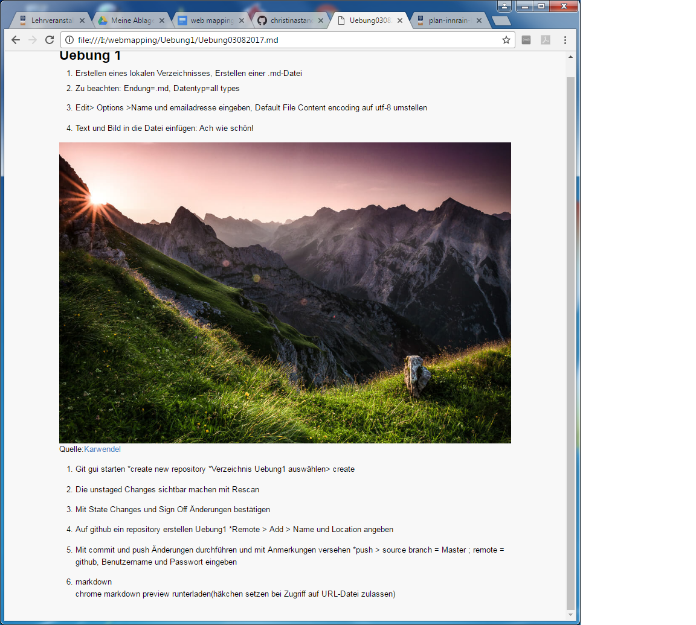

#Uebung 1

1. Erstellen eines lokalen Verzeichnisses, Erstellen einer .md-Datei 
* Zu beachten: Endung=.md, Datentyp=all types
* Edit> Options >Name und emailadresse eingeben, Default File Content encoding auf utf-8 umstellen

2. Text und Bild in die Datei einfügen:
Ach wie schön!

Quelle:[Karwendel](http://karwendelhaus.com/wp-content/uploads/2015/09/Karwendel_Sonnenuntergang.jpg)

3. Git gui starten
*create new repository
*Verzeichnis Uebung1 auswählen> create

4. Die unstaged Changes sichtbar machen mit Rescan

5. Mit State Changes und Sign Off Änderungen bestätigen

6. Auf github ein repository erstellen Uebung1
*Remote > Add > Name und Location angeben

7. Mit commit und push Änderungen durchführen und mit Anmerkungen versehen
*push > source branch = Master ; remote = github, Benutzername und Passwort eingeben

8. markdown  
chrome markdown preview runterladen(häkchen setzen bei Zugriff auf URL-Datei zulassen)

9.speichern und .md file in ein leeres chrome-fenster ziehen

# und so soll das aussehen: 

